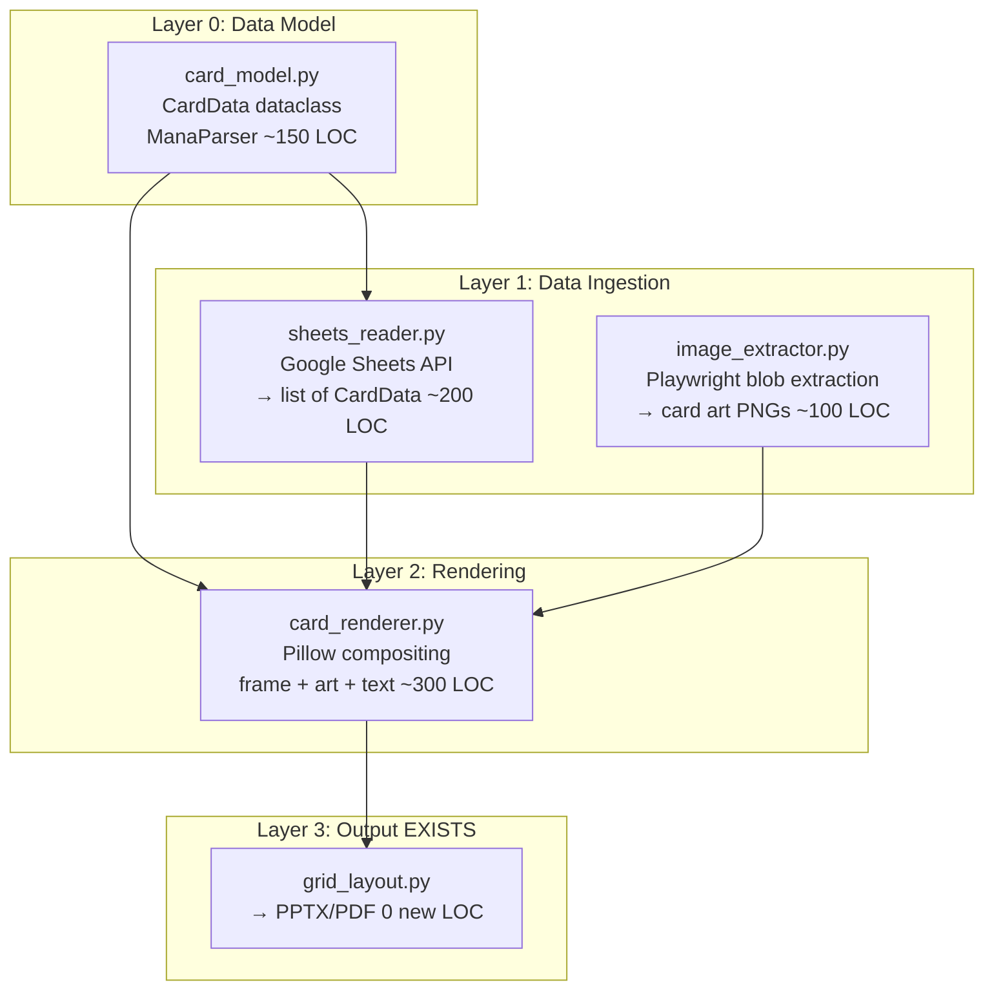

# Hellcube Custom Card Renderer — ALD Spec

**Version:** 1.0
**Date:** 2026-03-14
**Deadline:** 2026-03-26 (AJ's birthday, 12 days)
**Status:** Ready for Implementation
**Scope:** ~500-800 LOC across 4 modules

---

## 1. What This Is

A custom MTG card renderer that pulls AJ's Hellcube data from Google Sheets, composites each card with proper MTG-style frames, and outputs print-ready proxy sheets via existing `grid_layout.py`.

**Output:** ~100 physical custom proxy cards, printed on cardstock, cut, sleeved, handed to AJ on March 26.

---

## 2. AAF Dimension — Why This Gift Lands

| Dimension | Score | Why |
|-----------|-------|-----|
| Pi (Precision) | 8/10 | MTG card frame is deeply encoded visual grammar. Getting proportions right fires recognition at 77-100ms. |
| H (Entropy Gap) | 6/10 | AJ knows the cards exist. Gap is medium shift: spreadsheet → physical object. |
| M (Misattribution) | 7/10 | Craftsmanship charge misattributes to "these are real" not "Joey spent time." |
| I (Identity) | 9/10 | The Hellcube is AJ's creative work. Materializing it validates his identity as a game designer. |
| T (Temporal Coherence) | 7/10 | See stack → pick up card → recognize frame → "wait, this is MY card" → notice correct details → "he turned my spreadsheet into real cards." |
| **AAF Composite** | **74/100** | |

**Highest-ROI moves:**
- Color-correct frames per card color (+5-7 to Pi)
- Proper MTG font (Beleren) (+3-5 to Pi)
- Print author name on each card (+2-3 to Identity)
- Card art in frames (+8-12 to Pi, T) — **SOLVED via Playwright extraction**

---

## 3. LDD — Package Dependency Lattice



### Card Data Structure (from spreadsheet)

Each card block = ~9 rows × 6 color columns:
- Row: `name` — "Batman Blue (Bu,Bu)(1)"
- Row: `pic` — embedded image (extracted via Playwright)
- Row: `Types` — "Creature- Human, Batman, Hero"
- Row: `text` × 3 — ability lines
- Row: `flavor` — flavor text
- Row: `Stats` — "2/4"
- Row: `Author` — "Joey" or "AJ"

Columns: C=Blue, E=Black, G=Red, I=White, K=Green, M=Colorless

### Key Decision: Image Extraction is SOLVED

**Method:** Open Google Sheet in Playwright → images render as blob URLs in DOM → fetch blobs → convert base64 → decode to PNG/JPG files.

**Proof of concept completed 2026-03-14:** Successfully extracted 113 images from the Hellcube sheet via this pipeline. First image verified as card art (cartoon character). No fallback strategy needed.

**Remaining work:** Map extracted images to card positions (by DOM order vs spreadsheet column/row order). May need position-based mapping.

---

## 4. Card Frame Design

Standard MTG card at 300 DPI = 750 x 1050 pixels.

```
+------------------------------------------+  y=0
|  [Name Bar]           [Mana Cost Symbols] |  y=0-60
+------------------------------------------+  y=60
|                                          |
|              [Art Window]                |  y=60-530
|                                          |
+------------------------------------------+  y=530
|  [Type Line]                             |  y=530-575
+------------------------------------------+  y=575
|                                          |
|  [Rules Text — up to 3 lines]            |  y=575-850
|  [Flavor Text — italic]                  |
|                                          |
+------------------------------------------+  y=850
|  [by {author}]                [P/T Box]  |  y=850-900
+------------------------------------------+
```

### Color Palette

| Color | Frame | Text Box | Name |
|-------|-------|----------|------|
| W | #F9FAF4 | #F5F0E0 | Warm ivory |
| U | #0E68AB | #C9DEF0 | Ocean blue |
| B | #150B00 | #CBC2BF | Smoke gray |
| R | #D3202A | #F5C7B0 | Warm red |
| G | #00733E | #C4D3CA | Forest green |
| C | #A0A4A8 | #D8D8D8 | Steel gray |

---

## 5. Sprint Plan

### Sprint 1: MVP (Mar 15-18) — Playable Output

| Day | Task | Deliverable |
|-----|------|-------------|
| 1 | `card_model.py` — dataclass + mana parser | Parse "(Bu,Bu)(1)" → ['U','U','1'] |
| 1 | `sheets_reader.py` — read all blocks via Sheets API | list[CardData] from live sheet |
| 2-3 | `card_renderer.py` — Pillow compositing, black frames | Single card PNG |
| 4 | `render_hellcube.py` — glue → grid_layout.py → PDF | Full printable PDF, text-only |

**Exit:** Print PDF, play a game with the cards. Text readable, data correct.

### Sprint 2: Polish (Mar 19-22) — Looks Right

| Day | Task |
|-----|------|
| 5-6 | 6 color frame variants |
| 5 | Mana symbol rendering |
| 6 | Font integration (Beleren Bold + MPlantin) |
| 6-7 | Image extraction batch (all 113 images, map to cards) |
| 8 | Buffer / fix |

**Exit:** Color-correct cards with art, proper typography.

### Sprint 3: Ship (Mar 23-26) — In Hand

| Day | Task |
|-----|------|
| 9 | Full render all ~100 cards |
| 10 | Visual QA — every card checked |
| 11 | Print on cardstock, cut |
| 12 | Buffer. Birthday. |

### What Gets Cut (in order if behind):
1. Mana symbols → print as text "(2)(U)(U)"
2. Flavor text → abilities only
3. Ornate frames → solid color rectangles
4. Stats box styling → plain text overlay

---

## 6. What NOT to Build

- Set symbols / expansion icons
- Foil / holographic effects
- Double-faced card support
- Card balancing / rules validation
- Web UI
- Scryfall integration
- Card back design (print single-sided, sleeve with real card behind)
- Generic sheet parser (hardcode this one spreadsheet)
- Mana cost parser beyond what AJ uses
- Retry/caching for Sheets API (call once, dump to JSON)

---

## 7. Risk Register

| Risk | Prob | Mitigation |
|------|------|------------|
| Image-to-card mapping wrong order | Med | Compare image dimensions to card position; manual spot-check |
| Mana cost syntax varies | Med | Parse with test cases from real data first |
| Text overflow in rules box | Med | Auto-scale font size, min 8pt |
| Card block not always 8 rows | Med | Parse by landmark (Stats "X/Y" = block end) |
| Print colors too dark/light | Med | Test print day 1 of Sprint 3 |

---

## 8. Auth & Config

| Service | Token Location | Status |
|---------|---------------|--------|
| Google Drive | ~/.config/gdrive_token.json | Refreshed 2026-03-14, has refresh_token |
| Google Sheets | Same client credentials | Works via Sheets API |
| Gmail | ~/.config/gmail_token.json | Not needed for this project |

Sheet ID: `1qbW9T5lAbDmiVoENS7MJ7EcLcDC-R4mfQqCx2aehe4Q`

---

## 9. Existing Code to Reuse

| File | Reuse | Notes |
|------|-------|-------|
| grid_layout.py (342 LOC) | **USE DIRECTLY** | Configurable image grid → PPTX/PDF. `--preset mtg --pdf` |
| generate_deck.py | Reference only | Card dimension math at lines 44-86 |
| requirements.txt | Extend | Add `gspread` or use raw Sheets API via requests |

---

## 10. Definition of Done

**Done:** All cards rendered → PDF → printed → cut → sleeved → AJ holds them March 26.

**Good:** + Frame colors match card colors + text readable + fonts approximate MTG + author name on every card.

**Great:** + Card art present + mana symbols as colored pips + indistinguishable from professional custom proxies at arm's length.

---

*End of Spec*
